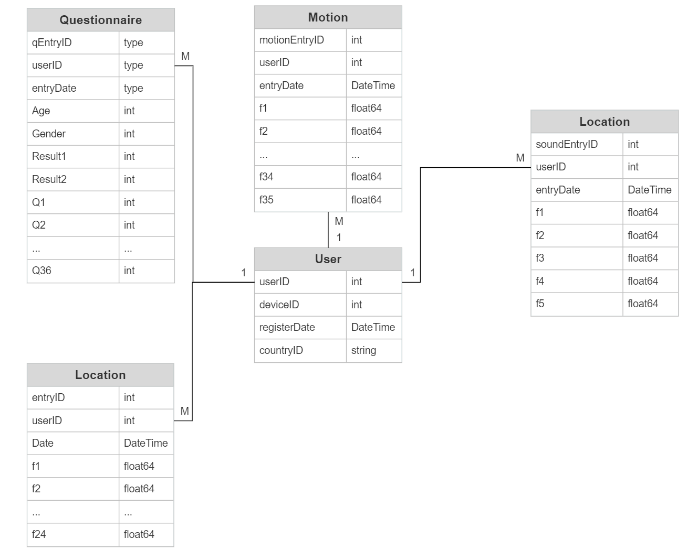

# HealthPredict

Smartphones are becoming increasingly pervasive in almost every aspect of daily life. With smartphones being equipped with multiple sensors, they provide an opportunity to automatically extract information relating to daily life. Information relating to daily life could have major benefits in the area of health informatics. Research shows that there is a need for more objective and accurate means of measuring health status. Hence, this work investigates the use of multi-modal smartphone sensors to measure human behaviour and generate behaviour profiles which can be used to make objective predictions related to health status. 

A dataset was collected using the <a href="https://github.com/dnlkelly1/Health-U">Health-U</a> app. Three sensor modalities were recorded to model three different components of human behaviour. Motion sensors are utilised to measure physical activity, location sensors are utilised to measure travel behaviour and sound sensors are used to measure voice activity related behaviour. Over 2000 users uploaded over 600,000 hours of data using the <a href="https://github.com/dnlkelly1/Health-U">Health-U</a> App.

### Entity Relationship Diagram for Health-U Database:

  

